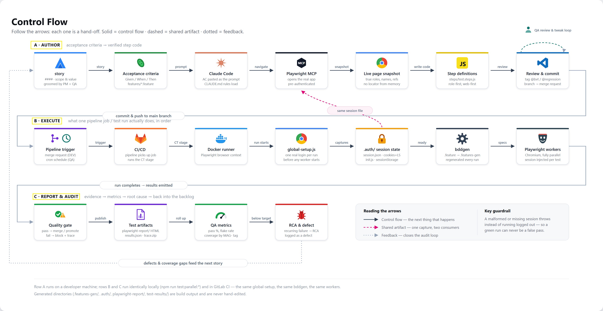

# 🎭 test01 — Playwright BDD Test Suite

> End-to-end browser tests written in plain-English Gherkin, powered by [Playwright](https://playwright.dev/) and [playwright-bdd](https://github.com/vitalets/playwright-bdd).

## ✨ Capabilities

- 🥒 **Gherkin / BDD scenarios** — write test cases in `Given / When / Then` syntax under [features/](features/)
- 🎭 **Playwright test runner** — fast, reliable, cross-browser automation with auto-waiting and built-in retries
- 🔐 **Session injection** — logs in once in [global-setup.js](global-setup.js) and replays the saved session (cookies, `localStorage`, `sessionStorage`) into every scenario, so tests skip re-authenticating each run. The captured state is written in Playwright's native `storageState` format so the *same* capture also authenticates the Playwright MCP browser — see [Session state](#-session-state) below
- 📊 **Rich reporting** — HTML report (`playwright-report/`) and JSON results (`test-results/results.json`) for CI dashboards and local debugging
- 🖥️ **Multi-browser ready** — Chromium configured out of the box; Firefox, WebKit, mobile, and branded-browser projects are pre-scaffolded and ready to enable
- 🔁 **Parallel execution** — fully parallel test files with configurable worker count
- 🤖 **AI-assisted authoring** — [Playwright MCP server](.mcp.json) wired up so Claude Code can drive a real browser to generate/debug steps. It's pre-authenticated from the same capture the tests use — `--storage-state` for cookies, `--init-script` for web storage — so it sees the app exactly as a real scenario does. Requires both `.auth/` artifacts to exist already (run `npm run test:parallel:headless` once if they don't)
- 🧩 **Editor integration** — [.vscode/extensions.json](.vscode/extensions.json) recommends Specwright and Claude Code, pre-wired via [.vscode/settings.json](.vscode/settings.json) to this repo's `features/` and `steps/` folders

## 📁 Project structure

```
├── features/            🥒 Gherkin .feature files (test scenarios)
├── steps/               🪜 Step definitions implementing the Gherkin steps
├── playwright.config.js  ⚙️ Playwright + BDD configuration
├── global-setup.js       🔐 Logs in once, captures the session before tests run
├── session-state.js      📜 Session-file format contract (read / write / validate)
├── .auth/session.json    🍪 Cookies + localStorage (Playwright storageState format)
├── .auth/session.init.js 🧩 Web-storage init script for the MCP browser
├── .mcp.json             🤖 Playwright MCP server for AI-driven browsing
├── CLAUDE.md             🤖 Project instructions for Claude Code
└── .vscode/              🧩 Recommended extensions (extensions.json) & Cucumber config (settings.json)
```

## 🚀 Getting started

```bash
npm install
npx playwright install     # download browser binaries
```

## ▶️ Running tests

| Command | Description |
|---|---|
| `npm run bddgen` | ⚙️ Generate BDD spec files from `.feature` files into `.features-gen/` |
| `npm run test:parallel:headed` | 🖼️ Generate + run with 2 workers, browser visible (`--headed`) |
| `npm run test:parallel:headless` | 🤖 Generate + run with 2 workers, no browser UI |
| `npm run test:debug` | 🐞 Run with the Playwright Inspector for step-by-step debugging |
| `npm run report` | 📊 Open the last Playwright HTML report |

## 🖊️ Writing a new scenario

1. Add a `Scenario` to a `.feature` file in [features/](features/) using `Given/When/Then`
2. Implement any missing steps in [steps/](steps/) using `createBdd()` from `playwright-bdd`
3. Run `npm run test:parallel:headed` (or `test:parallel:headless`) — `bddgen` auto-generates Playwright spec files from your Gherkin

## 🔐 Session state

[global-setup.js](global-setup.js) logs in **once per test run**, before any worker starts, and writes two artifacts into `.auth/` from a single capture:

| Artifact | Contents | Consumed by |
|---|---|---|
| `session.json` | `{ cookies, origins[].localStorage, sessionStorage }` | `npx playwright test` and MCP's `--storage-state` |
| `session.init.js` | localStorage + sessionStorage inlined as an init script | MCP's `--init-script` |

Two artifacts are needed because Playwright's `storageState` cannot carry `sessionStorage` — the [auth docs](https://playwright.dev/docs/auth) state plainly that *"Playwright does not provide API to persist session storage."* The test step works around this with `page.addInitScript()`; the MCP server needs the equivalent as a file on disk. The net result:

| State | `npx playwright test` | Playwright MCP |
|---|---|---|
| Cookies | ✅ | ✅ |
| localStorage | ✅ | ✅ |
| sessionStorage | ✅ | ✅ |
| IndexedDB | ❌ | ❌ |

[session-state.js](session-state.js) owns the file format and is the only thing that reads or writes it. It **validates on every read and throws** rather than injecting a partial session, because the failure it guards against is silent: Playwright ignores unrecognised keys, so a hand-written file (singular `origin`, object-shaped `localStorage`) produces a logged-out browser with no error at all.

**Gotchas**

- 🚫 **Never hand-edit `.auth/`.** Both files are generated. Delete them and re-run to refresh.
- ♻️ **Expired sessions are not auto-refreshed.** Setup reuses a valid file as-is; delete `.auth/session.json` to force a fresh login.
- 📇 **IndexedDB is not captured.** Needs `storageState({ indexedDB: true })`. If your app stores its token there, the session will be incomplete.
- 🔑 **`session.init.js` holds real session values in plaintext.** `.auth/` is gitignored — keep it that way.
- 🔨 The login body in [global-setup.js](global-setup.js) is still a `TODO` stub; put your real credentials flow there.

## 🤖 CLAUDE.md — guidance for Claude Code

[CLAUDE.md](CLAUDE.md) is a project-level instructions file read automatically by Claude Code. It tells Claude how this repo is organized (`features/`, `steps/`, `playwright.config.js`, and which folders are generated output that should never be hand-edited) and enforces a verify-before-writing workflow for step definitions: before adding or updating a step in [steps/](steps/), Claude must use the Playwright MCP server (configured in [.mcp.json](.mcp.json)) to navigate the real page, take a snapshot, and confirm selectors/behavior — rather than guessing locators from memory. This keeps AI-generated step definitions accurate and in sync with the actual application UI.

It also encodes the session-state contract as a hard gate: both `.auth/` artifacts must exist and be well-formed before Claude touches the MCP browser, and if they aren't, Claude must stop and ask you to run the suite rather than run it itself or verify against a logged-out page.

## 🛠️ Recommended VS Code extensions

Listed in [.vscode/extensions.json](.vscode/extensions.json) — installed automatically when prompted, or via **Extensions: Show Recommended Extensions**:

- 🥒 **Specwright — BDD Authoring for Playwright** (`upscaled-dev.specwright`) — Gherkin syntax highlighting, step navigation/autocomplete, and a test runner for `playwright-bdd`, pointed at [features/](features/) and [steps/](steps/) via `playwrightBddRunner.testFilePattern` / `playwrightBddRunner.stepDefinitionPaths` in [.vscode/settings.json](.vscode/settings.json)
- 🤖 **Claude Code** (`anthropic.claude-code`) — AI pair-programming inside VS Code

