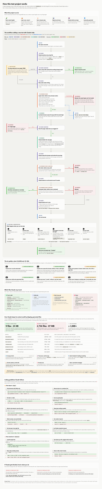

# mb-autotest-ai

## ✨ Capabilities

- 🥒 **Gherkin scenarios** — test cases in `Given / When / Then` under [features/](features/), run by the Playwright test runner
- 🔐 **One login per run** — [global-setup.js](global-setup.js) captures the session once and every scenario replays it ([Session state](#-session-state))
- 📊 **Reporting** — HTML report in `playwright-report/`, JSON results in `test-results/results.json`
- 🔁 **Parallel runs** — fully parallel test files; the `test:parallel:*` scripts use 3 workers
- 🤖 **Claude Code, with guardrails** — Claude drafts steps against the live app through the Playwright MCP browser, and hooks stop it from breaking the project's rules ([Working with Claude Code](#-working-with-claude-code))
- 🧩 **Editor setup** — [.vscode/settings.json](.vscode/settings.json) wires up Specwright and Prettier format-on-save

## 📁 Project structure

```
├── features/             🥒 Gherkin .feature files (test scenarios)
├── steps/                🪜 Step definitions implementing the Gherkin steps
├── playwright.config.js  ⚙️ Playwright + BDD configuration
├── global-setup.js       🔐 Logs in once, captures the session before tests run
├── session-state.js      📜 Session-file format contract (read / write / validate)
├── .mcp.json             🤖 Playwright MCP server for Claude's browser
├── CLAUDE.md             🤖 Instructions Claude Code reads every session
├── .claude/settings.json 🛡️ The harness: hooks that enforce CLAUDE.md's key rules
├── .claude/hooks/        🛡️ The hook scripts
├── .prettierrc.json      🎨 Prettier config, including the Gherkin plugin
└── .vscode/settings.json 🧩 Specwright paths + Prettier format-on-save
```

Generated — gitignored, never hand-edit: `.auth/` (the captured session), `.features-gen/`, `test-results/`, `playwright-report/`, `.playwright-mcp/`.

## 🚀 Getting started

Needs Node.js with npm; the Claude Code hooks also need `node` on your PATH.

```bash
npm install
npx playwright install     # browser binaries: Chromium runs the tests, Firefox runs the one-time login
```

## ▶️ Running tests

| Command                                            | Description                                                                  |
| -------------------------------------------------- | ---------------------------------------------------------------------------- |
| `npm run bddgen`                                   | ⚙️ Generate BDD spec files from `.feature` files into `.features-gen/`       |
| `npm run clean`                                    | 🧹 Delete `.features-gen/` (every test script does this first)               |
| `npm run test:parallel:headed`                     | 🖼️ Clean, generate, and run with 3 workers, browser visible (`--headed`)     |
| `npm run test:parallel:headless`                   | 🤖 Clean, generate, and run with 3 workers, no browser UI                    |
| `npm run test:debug`                               | 🐞 Clean, generate, and run in the Playwright Inspector (headed, one worker) |
| `npm run test:debug -- --grep "@tag"               | 🐞 Same, for a single tag                                        |
| `npm run report`                                   | 📊 Open the last Playwright HTML report                                      |
| `npm run format` / `npm run format:check`          | 🎨 Format with Prettier / only check formatting                              |

Every test run starts with global setup: Firefox (headless by default; set `LOGIN_HEADLESS=false` in `.env` to see it) logs in and writes a fresh `.auth/` (see [Session state](#-session-state)).

## 🖊️ Writing a new scenario

1. Add a `Scenario` to a `.feature` file in [features/](features/). To run it logged in, start with `Given I inject session state from file`, as the `Background` in [features/TEST-XXX1.feature](features/TEST-XXX1.feature) does
2. Add any missing steps in [steps/](steps/) using `createBdd()` from `playwright-bdd` — or ask Claude Code to draft them ([below](#-working-with-claude-code))
3. Run `npm run test:parallel:headed` (or `test:parallel:headless`); `bddgen` generates the Playwright spec files from your Gherkin first

## 🔐 Session state

[global-setup.js](global-setup.js) logs in **once per test run**, before any worker starts, and writes two files into `.auth/` from the same capture:

| File              | Holds                                                                                                                        | Used by                                                                          |
| ----------------- | ---------------------------------------------------------------------------------------------------------------------------- | -------------------------------------------------------------------------------- |
| `session.json`    | Cookies and per-origin `localStorage` in Playwright's native `storageState` format, plus `sessionStorage` as one extra field | The `I inject session state from file` step; the MCP browser's `--storage-state` |
| `session.init.js` | `localStorage` + `sessionStorage` as a script that runs before every page                                                    | The MCP browser's `--init-script`                                                |

Two files are needed because Playwright's `storageState` can't carry `sessionStorage` — the [auth docs](https://playwright.dev/docs/auth) say _"Playwright does not provide API to persist session storage."_ Together they restore cookies, `localStorage` and `sessionStorage` in both the tests and the MCP browser.

[session-state.js](session-state.js) owns the format: it's the only code that writes the file, and everything that checks it — the test step and Claude's session gate — uses its validator, which **throws** instead of letting a malformed file through. That matters because Playwright silently ignores keys it doesn't recognise, so a hand-written file (singular `origin`, object-shaped `localStorage`) gives you a logged-out browser and no error.

**Gotchas**

- 🚫 **Never hand-edit `.auth/`.** Every run wipes it and logs in fresh (including `test:debug`), so re-running the suite is how you replace an expired session.
- 📇 **IndexedDB isn't captured** (that needs `storageState({ indexedDB: true })`). If your app keeps its token there, the session will be incomplete.
- 🔑 **`session.init.js` holds real session values in plaintext.** `.auth/` is gitignored — keep it that way.
- 🔨 **The login targets the site** (Firefox, headless unless `LOGIN_HEADLESS=false`, in [global-setup.js](global-setup.js)); replace that flow to point the suite at your own app.

## 🤖 Working with Claude Code

Two layers keep Claude in line:

- **[CLAUDE.md](CLAUDE.md) is instructions.** Claude Code reads it at the start of every session, but nothing enforces it — Claude follows it by choice.
- **The harness is enforcement.** `PreToolUse` hooks in [.claude/settings.json](.claude/settings.json) run on every matching tool call and block the ones that break a rule, whether or not Claude remembers it.

What the hooks cover (details in [CLAUDE.md](CLAUDE.md) §0):

- 🚫 **No suite runs** (N1): blocks `playwright test`, `bddgen`, global setup and npm scripts that wrap them, including through a script file.
- 🔐 **Session gate** (N2): blocks Playwright MCP browser calls unless `.auth/` is valid, consistent, unexpired and under an hour old.
- 🧱 **No hand-edits to generated output** (N4): file tools and common shell writes.
- 🧩 **No changes to existing step definitions** (N6): only new steps are allowed, and filling a `TODO` stub prompts you first.
- 🛡️ **Harness changes prompt you**: edits to `.claude/`, `session-state.js` or `.mcp.json` need your approval.

Hooks fail closed: if one breaks, the call is blocked rather than let through. Denials and prompts are logged to `.claude/hooks/hook.log` (gitignored). After changing a hook, run `npm run hooks:test`.



## 🛠️ Recommended VS Code extensions

[.vscode/settings.json](.vscode/settings.json) is already configured for these — install them from the Extensions view:

- 🥒 **Specwright — BDD Authoring for Playwright** (`upscaled-dev.specwright`) — Gherkin syntax highlighting, step navigation/autocomplete, and a test runner for `playwright-bdd`, pointed at [features/](features/) and [steps/](steps/) via `playwrightBddRunner.testFilePattern` / `playwrightBddRunner.stepDefinitionPaths`
- 🎨 **Prettier** (`esbenp.prettier-vscode`) — the workspace's default formatter, run on every save
- 🤖 **Claude Code** (`anthropic.claude-code`) — AI pair-programming inside VS Code
